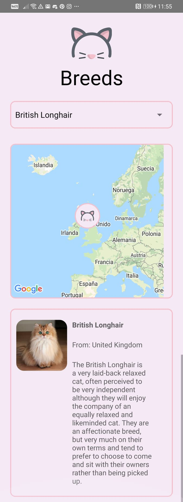

# Cat Breeds

React native app to search where all cat breeds come from
(For android only) 

## Created with React-native-cli

To test: 
$ npm i
$ npx react-native run-android

## Files and folders

I used a main container to manage all logic.
I created many components to set the views (header, map, select)
A folder to manage all Api requests.
A folder to set Constants.
A folder for Assets
And a __test__ folder

## Tests

I used a function to manage the match between cats and countries and get coordinates. This is the only function that i tested, handled errors and all variables and props imported, not hardcoded

## What would I do with more time?

I would create a main Layout to set styles to all app
Create a state manager like Redux or another
Check compatibility with another devices

## What would I do with more time?

I would create a main Layout to set styles to all app
Create a state manager like Redux or another
Check compatibility with another devices
Im not a pro with testing, i can learn a lot about it